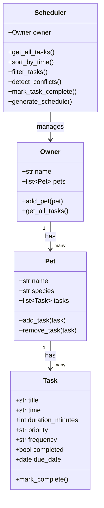

# PawPal+ (Module 2 Project)

**PawPal+** is a smart pet care management system built with Python and Streamlit. It helps owners keep their pets happy and healthy by tracking daily routines — feedings, walks, medications, and appointments — with intelligent scheduling algorithms.

---

## Scenario

A busy pet owner needs help staying consistent with pet care. They want an assistant that can:

- Track pet care tasks (walks, feeding, meds, enrichment, grooming, etc.)
- Consider constraints (time, priority, frequency)
- Produce a daily plan sorted by time and priority
- Warn about scheduling conflicts

---

## Features

- **Owner & Multi-Pet Management** — Register an owner and add multiple pets (dog, cat, rabbit, etc.)
- **Task Scheduling** — Add tasks with time, duration, priority (high/medium/low), and frequency (daily/weekly/once)
- **Sorting by Time** — Today's schedule is always displayed in chronological order; same-time tasks are ordered by priority
- **Filtering** — Filter tasks by pet name, completion status, or priority level
- **Conflict Warnings** — Automatically flags when two tasks for the same pet share the same time slot
- **Recurring Tasks** — Marking a daily or weekly task complete automatically creates the next occurrence
- **Task Completion** — Mark tasks done from the UI; one-time tasks are removed from the active schedule

---

## Smarter Scheduling

The `Scheduler` class provides four algorithmic capabilities:

| Feature | How it works |
|---|---|
| **Sort by time** | Uses Python's `sorted()` with a `lambda` key on `task.time` (HH:MM string), then secondary sort by priority |
| **Filter tasks** | Chains optional filters (pet name, completion status, priority) over the full task list |
| **Conflict detection** | Scans each pet's tasks for duplicate time values; returns human-readable warning strings |
| **Recurring task automation** | `mark_complete()` on a `Task` returns a new `Task` with `due_date + timedelta(days=1)` or `+timedelta(weeks=1)` |

---

## System Architecture (UML)



---

## Getting Started

### Setup

```bash
python -m venv .venv
# Windows:
.venv\Scripts\activate
# Mac/Linux:
source .venv/bin/activate

pip install -r requirements.txt
```

### Run the CLI demo

```bash
python main.py
```

### Run the Streamlit app

```bash
streamlit run app.py
```

---

## Testing PawPal+

```bash
python -m pytest
```

The test suite (`tests/test_pawpal.py`) covers:

- **Task completion** — `mark_complete()` flips `completed` to `True`
- **Recurring tasks** — daily tasks reschedule +1 day; weekly tasks reschedule +7 days; one-time tasks do not reschedule
- **Pet task count** — `add_task()` and `remove_task()` correctly update the pet's task list
- **Sorting correctness** — tasks are always returned in chronological (HH:MM) order; ties broken by priority
- **Filtering** — filters by pet name, status, and priority return only matching tasks
- **Conflict detection** — flags duplicate time slots; no false positives when slots are unique
- **Edge cases** — owner with no pets, pet with no tasks

**Confidence Level: ★★★★★ (5/5)** — All 17 tests pass.

---

## Project Structure

```
pawpal-plus/
├── app.py                # Streamlit UI
├── pawpal_system.py      # Backend classes: Task, Pet, Owner, Scheduler
├── main.py               # CLI demo script
├── requirements.txt
├── reflection.md
└── tests/
    └── test_pawpal.py    # Automated pytest suite
```

---

## 📸 Demo

*(Add a screenshot of your running Streamlit app here)*
